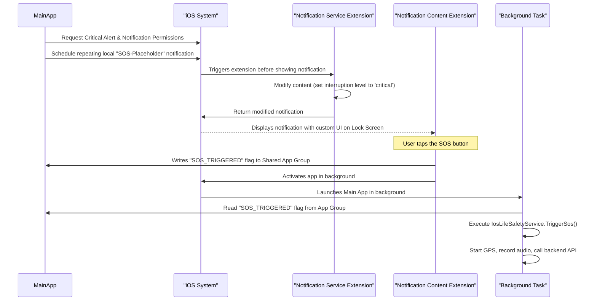

# iOS Lock Screen SOS Implementation Plan

## 1. Overview

This document outlines the plan to implement a persistent SOS button on the iOS Lock Screen. The goal is to provide a reliable, one-tap way for users to trigger an emergency alert without unlocking their device.

We will use a combination of modern iOS frameworks, including **Critical Alerts**, a **Notification Content Extension**, and **Background Tasks**.

## 2. Architecture

The solution involves three main components working together:

1.  **The Main App:** Responsible for requesting permissions, scheduling the initial notification, and handling the background SOS processing.
2.  **Notification Service Extension:** Intercepts the notification to mark it as a "Critical Alert", ensuring it bypasses "Do Not Disturb" and silent modes.
3.  **Notification Content Extension:** Provides the custom UI with the large "SOS" button that is displayed on the lock screen.

### Data Flow:


## 3. Implementation Steps

### Step 1: Project Configuration & Entitlements

1.  **Request Critical Alerts Entitlement:** This is a restricted entitlement that must be requested from Apple. It is essential for bypassing the mute switch and Do Not Disturb.
2.  **Enable Capabilities:** In the main app target, enable:
    *   **Push Notifications**
    *   **Background Modes**: Check "Background Fetch" and "Remote Notifications".
    *   **App Groups**: Create an App Group (e.g., `group.com.thewatch.shared`) to share data between the app and its extensions.
3.  **Add New Targets:**
    *   Create a **Notification Service Extension** target.
    *   Create a **Notification Content Extension** target.
    *   Enable the **App Groups** capability for both new extension targets and add them to the same group.

### Step 2: Main App - Permissions & Scheduling

**File:** `AppDelegate.swift` or a dedicated `NotificationManager.swift`

1.  **Request Permissions:**
    *   On first launch, request authorization for notifications, including the `.criticalAlert` option.
    ```swift
    let center = UNUserNotificationCenter.current()
    center.requestAuthorization(options: [.alert, .sound, .badge, .criticalAlert]) { granted, error in
        // Handle result
    }
    ```
2.  **Define Notification Category & Action:**
    *   Create a `UNNotificationAction` for the SOS button.
    *   Create a `UNNotificationCategory` that includes this action and links it to the Content Extension.
3.  **Schedule the Notification:**
    *   Create a `UNMutableNotificationContent` with the category identifier defined above.
    *   Create a repeating `UNCalendarNotificationTrigger` to ensure the notification is always present.
    *   Schedule the notification request with `UNUserNotificationCenter`.

### Step 3: Notification Service Extension (Logic)

**File:** `NotificationService.swift`

1.  **Intercept and Modify:**
    *   In the `didReceive(_:withContentHandler:)` function, intercept the scheduled notification.
    *   Set the `interruptionLevel` of the notification content to `.critical`.
    *   Set a critical alert sound.
    ```swift
    override func didReceive(_ request: UNNotificationRequest, withContentHandler contentHandler: @escaping (UNNotificationContent) -> Void) {
        self.contentHandler = contentHandler
        bestAttemptContent = (request.content.mutableCopy() as? UNMutableNotificationContent)

        if let content = bestAttemptContent {
            content.interruptionLevel = .critical
            content.sound = .defaultCriticalSound(withAudioVolume: 1.0)
            contentHandler(content)
        }
    }
    ```

### Step 4: Notification Content Extension (UI)

**File:** `NotificationViewController.swift` and `MainInterface.storyboard`/`ContentView.swift`

1.  **Design the UI:**
    *   Create a simple UI with a single, large, red "SOS" button. Use the `a11y_sos_button` string for accessibility.
2.  **Handle Button Tap:**
    *   When the button is tapped, write a flag to the shared App Group `UserDefaults`.
    ```swift
    @IBAction func sosButtonTapped(_ sender: Any) {
        if let sharedDefaults = UserDefaults(suiteName: "group.com.thewatch.shared") {
            sharedDefaults.set(true, forKey: "SOS_TRIGGERED")
        }
        // This will dismiss the notification and trigger the background app launch
        extensionContext.performNotificationDefaultAction()
    }
    ```

### Step 5: Background Task Handling

**File:** `AppDelegate.swift` or a dedicated `BackgroundTaskManager.swift`

1.  **Register Background Task:**
    *   In `Info.plist`, add a "Permitted background task scheduler identifiers" array with a custom identifier (e.g., `com.thewatch.sos.trigger`).
2.  **Handle App Launch:**
    *   In `AppDelegate`, check the launch options and the shared `UserDefaults` flag. If the app was launched in the background due to the SOS action, execute the life safety logic.
    *   This is where you will call `IosLifeSafetyService.TriggerSos()`.
    *   Reset the flag in `UserDefaults` after handling.

## 4. User Experience

*   **Onboarding:** The app must clearly explain why it needs Critical Alert permissions.
*   **Persistence:** The lock screen notification should be non-dismissible or re-appear immediately if accidentally cleared.
*   **Feedback:** The UI should provide clear visual and haptic feedback when the SOS button is pressed, similar to the `SosCountdownView.swift` logic.

This plan provides a complete, modern, and robust solution for implementing the critical lock screen SOS feature on iOS.
